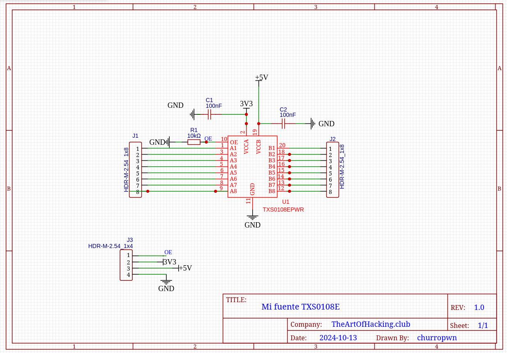
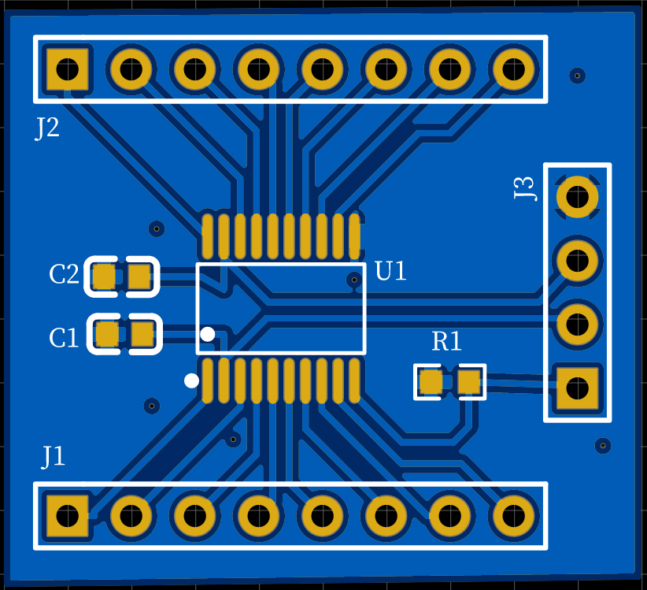
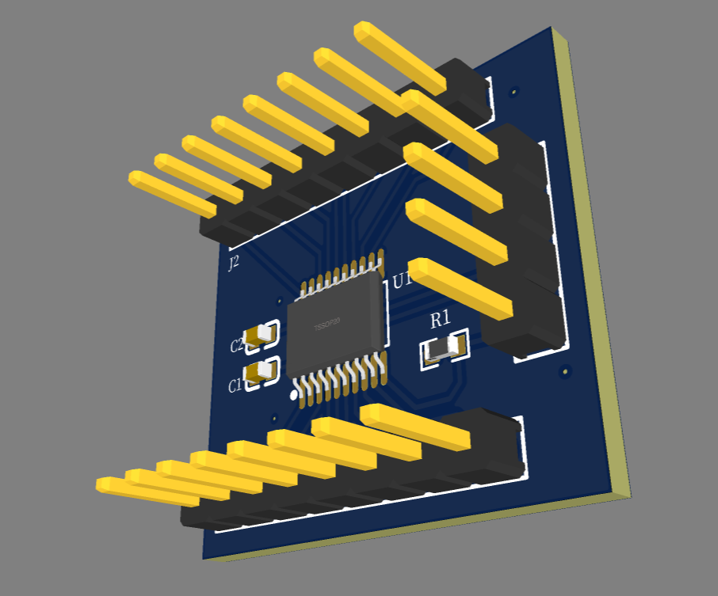

This is a PCB I created during the [@hardwarehacking_es](https://t.me/hardwarehackinges) workshop imparted by Julio M. Casais. 
This is a logic level converter between 3.3 and 5V
I created the following schematic

And built the followng PCB
#### 2D:

#### 3D:

